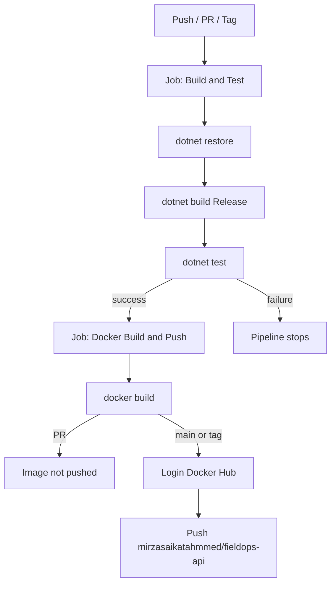
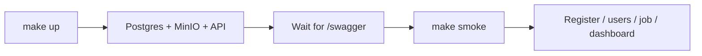
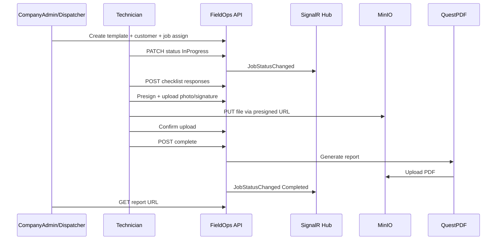
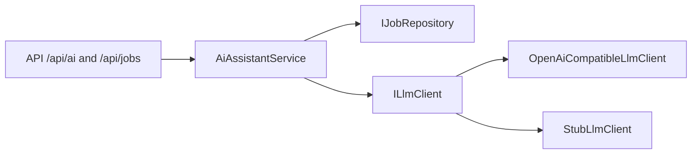
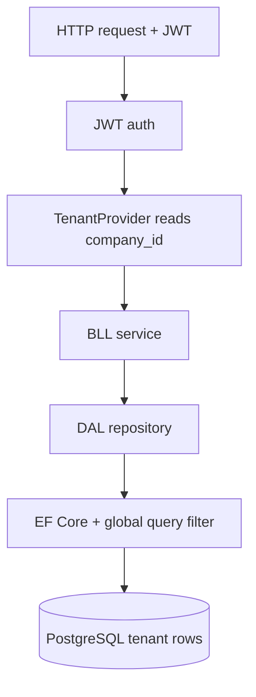

# FieldOps Workflows

This document describes the **CI/CD pipeline**, **local automation**, and the **domain job lifecycle** used in FieldOps.

---

## 1. CI/CD workflow (GitHub Actions)

**File:** [`.github/workflows/ci.yml`](../.github/workflows/ci.yml)

### Triggers

| Event | Runs |
|---|---|
| Pull request → `main` | Build, test, Docker **build only** (no push) |
| Push → `main` | Build, test, Docker build **+ push** |
| Tag `v*` (e.g. `v1.2.0`) | Build, test, Docker build **+ push** (semver tags) |
| Manual (`workflow_dispatch`) | Same as push |

### Pipeline diagram



### Jobs

#### Job A — Build & Test
1. Checkout repository  
2. Setup .NET 8  
3. `dotnet restore FieldOps.sln`  
4. `dotnet build -c Release`  
5. `dotnet test -c Release` (unit + integration / Testcontainers)

#### Job B — Docker Build & Push  
**Depends on:** Job A success  

1. Checkout  
2. Docker Buildx  
3. Login to Docker Hub *(skipped on PRs)*  
4. Tag metadata:
   - `latest` on `main`
   - `sha-<commit>`
   - Semver from `v*` tags  
5. Build from root `Dockerfile`  
6. Push only when **not** a pull request  

**Published image:** `mirzasaikatahmmed/fieldops-api`

### Required secrets

Repo → **Settings → Secrets and variables → Actions**

| Secret | Description |
|---|---|
| `DOCKERHUB_USERNAME` | Docker Hub username |
| `DOCKERHUB_TOKEN` | Docker Hub access token (not account password) |

### Dependabot

[`.github/dependabot.yml`](../.github/dependabot.yml) opens weekly PRs for:

- NuGet packages  
- GitHub Actions versions  
- Docker base images (monthly)

---

## 2. Local automation workflow

**Entry point:** [`Makefile`](../Makefile)  
**Scripts:** [`scripts/`](../scripts/)

### Quick commands

| Command | Workflow |
|---|---|
| `make ci` | Restore → build → test (mirrors CI Job A) |
| `make preflight` | Format verify + `make ci` (pre-push gate) |
| `make up` | Compose pull/up + wait until Swagger is up |
| `make smoke` | Curl happy-path against running API |
| `make demo` | `up` + `smoke` + interview talking points |
| `make migrate` | Apply EF Core migrations |
| `make down` / `make logs` | Stop stack / stream API logs |
| `make docker-build` | Build `mirzasaikatahmmed/fieldops-api:latest` locally |

### Local run flow



### Script map

| Script | Role |
|---|---|
| `scripts/dev-up.sh` | Copy `.env` if missing, `compose pull/up`, poll API readiness |
| `scripts/smoke-test.sh` | Automated API path: register → technician → customer → template → job → dashboard → comment → search |
| `scripts/interview-demo.sh` | Runs up + smoke and prints talking points |
| `scripts/migrate.sh` | `dotnet ef database update` |
| `scripts/preflight.sh` | `dotnet format --verify-no-changes` then `make ci` |

### Typical developer loop

```bash
# First time
cp .env.example .env
make up

# Every change
make preflight        # before push
# or just:
make ci

# Interview / demo
make demo
```

### Compose image

`docker-compose.yml` runs the API from:

`mirzasaikatahmmed/fieldops-api:latest`

Rebuild and retag locally with `make docker-build` if you need a local image.

---

## 3. Domain job workflow (business)

Real-world field inspection flow implemented by the API:



### Status transitions

```
Scheduled → InProgress → Completed
     ↘           ↘
      Cancelled   Cancelled
```

Invalid transitions (e.g. `Completed` → `Scheduled`) are rejected in BLL.

### AI assistants (optional LLM)

Configured under `Ai` in `appsettings.json` / env (`Ai__ApiKey`, `Ai__BaseUrl`, `Ai__Model`). When `Ai:ApiKey` is empty, `StubLlmClient` returns deterministic demo text (no outbound HTTP).

| Endpoint | Roles | Behavior |
|---|---|---|
| `POST /api/jobs/{id}/ai-summary` | CompanyAdmin, Dispatcher, Technician (own job) | Builds job context → LLM summary → persists `Job.AiSummary` / `AiSummaryGeneratedAt` (included in PDF when present) |
| `POST /api/ai/ask` | CompanyAdmin, Dispatcher | Answers from compact tenant job/dashboard JSON only |
| `GET /api/ai/risk-hints?limit=20` | CompanyAdmin, Dispatcher | BLL rule score (`Low`/`Medium`/`High`) + one-line LLM recommendation |



### Multi-tenant request path



---

## 4. Interview talking points (workflow)

When asked “how does your pipeline / workflow work?”:

1. **PR gate:** every PR builds and runs tests; image is built but not published.  
2. **Main gate:** tests must pass before Docker Hub gets a new `latest` image.  
3. **Local parity:** `make ci` mirrors the GitHub test job.  
4. **Domain workflow:** dispatcher creates jobs; technician completes checklist + signature; PDF is generated; SignalR notifies the company group in real time.  
5. **Tenancy:** JWT `company_id` + EF query filters enforce isolation without leaking cross-tenant 404s as “exists elsewhere.”

---

## 5. Related docs

- Root overview & API notes: [`README.md`](../README.md)  
- CI badge: shown at top of README when Actions is enabled on GitHub  
